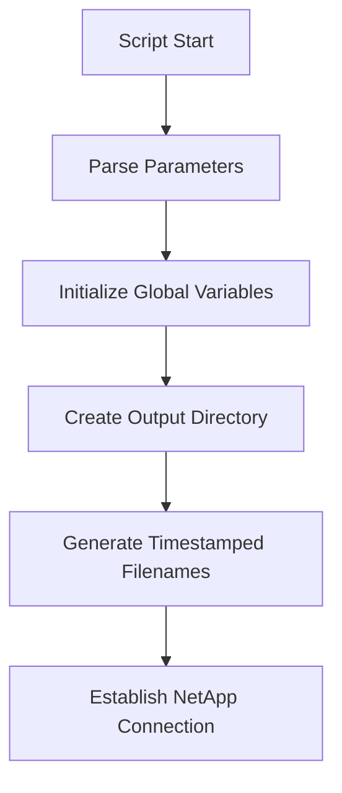
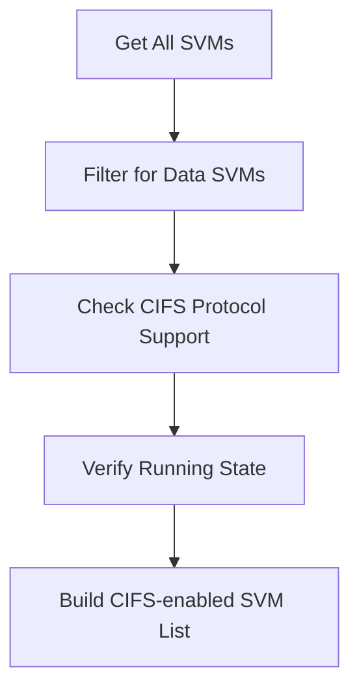
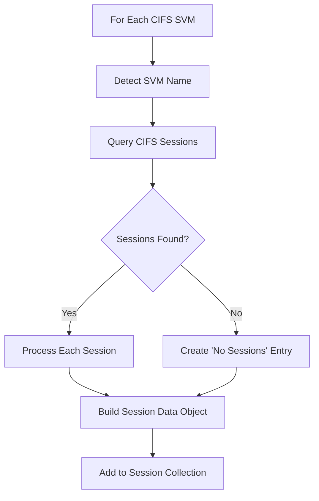
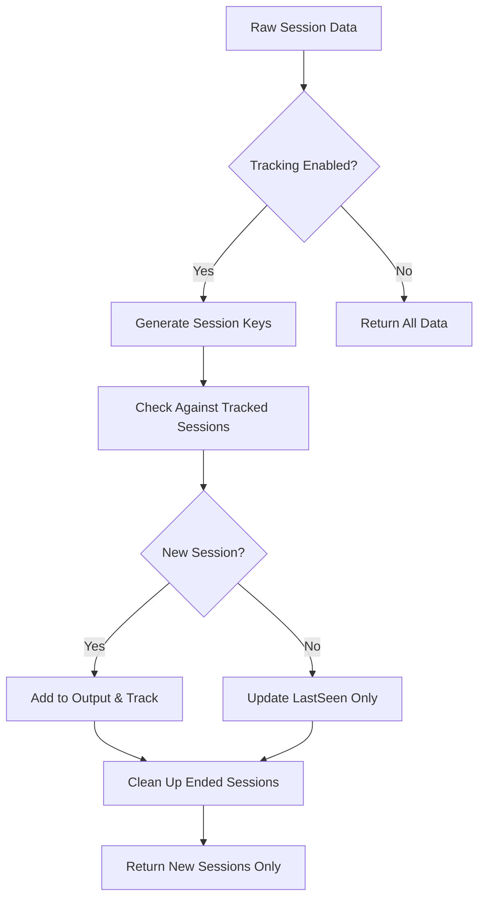
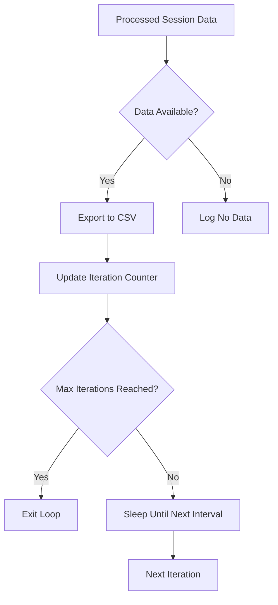

# Monitor-CIFSSessions.ps1 - Documentation

## Overview

The `Monitor-CIFSSessions.ps1` script provides continuous monitoring of CIFS (SMB) session information across all Storage Virtual Machines (SVMs) on a NetApp ONTAP cluster. It collects session data at regular intervals and exports it to timestamped CSV files with comprehensive logging and error handling.

## Table of Contents

- [Purpose](#purpose)
- [Architecture](#architecture)
- [Script Flow](#script-flow)
- [Core Functions](#core-functions)
- [Data Collection Logic](#data-collection-logic)
- [Session Tracking](#session-tracking)
- [Output Format](#output-format)
- [Error Handling](#error-handling)
- [Usage Examples](#usage-examples)

## Purpose

This script is designed to:
- Monitor CIFS session activity across NetApp ONTAP clusters
- Capture detailed session information including client connections, authentication details, and protocol information
- Provide historical tracking of session creation and termination
- Export session data for analysis and reporting
- Support both continuous monitoring and batch collection modes

## Architecture

### Dependencies
- **NetApp.ONTAP PowerShell Module** - Required for cluster communication
- **PowerShell 5.1+** - Core scripting environment
- **Network Access** - Direct connectivity to NetApp ONTAP cluster

### Key Components
1. **Parameter Handling** - Flexible configuration options
2. **Connection Management** - Secure cluster authentication
3. **SVM Discovery** - Automatic identification of CIFS-enabled SVMs
4. **Session Collection** - Real-time CIFS session data retrieval
5. **Data Processing** - Session uniqueness tracking and filtering
6. **File Management** - Timestamped logging and CSV export
7. **Error Handling** - Comprehensive error recovery and logging

## Script Flow

### 1. Initialization Phase



**Key Actions:**
- Parse command-line parameters with validation
- Initialize global tracking variables
- Create output directory structure if needed
- Generate timestamped log and CSV filenames
- Establish authenticated connection to NetApp cluster

### 2. SVM Discovery Phase



**Filtering Criteria:**
- **SVM Type**: Must be "data" (excludes admin, system, node SVMs)
- **Protocol Support**: Must have CIFS protocol enabled
- **State**: Must be in "running" state

### 3. Session Collection Phase



**SVM Name Detection Logic:**
The script tries multiple property names to identify each SVM:
1. `Name`
2. `VserverName` 
3. `Vserver`
4. `VServer`
5. `SvmName`

### 4. Data Processing Phase



### 5. Export Phase



## Core Functions

### `Initialize-OutputFiles()`

**Purpose**: Sets up the logging and CSV file infrastructure

**Logic**:
1. Create output directory if it doesn't exist
2. Generate timestamped filenames using cluster name
3. Initialize log file with monitoring parameters
4. Return success/failure status

**File Naming Convention**:
- Log: `Monitor_CIFSSessions_{ClusterName}_{timestamp}.log`
- CSV: `CIFS_Sessions_{ClusterName}_{timestamp}.csv`

### `Get-CIFSSessionData()`

**Purpose**: Core data collection function that discovers and queries all CIFS-enabled SVMs

**Logic Flow**:
1. **SVM Discovery**:
   ```powershell
   Get-NcVserver | Where-Object { 
       $_.VserverType -eq "data" -and 
       $_.AllowedProtocols -contains "cifs" -and 
       $_.State -eq "running" 
   }
   ```

2. **SVM Name Resolution**:
   - Iterate through potential property names
   - Use first valid property found
   - Log which property was selected

3. **Session Retrieval**:
   ```powershell
   Get-NcCifsSession -VserverContext $SVMName -ErrorAction SilentlyContinue
   ```

4. **Data Standardization**:
   - Create uniform PSCustomObject for each session
   - Add timestamp and cluster information
   - Handle "no sessions" case with placeholder entry

### `Get-UniqueSessionData()`

**Purpose**: Implements intelligent session tracking to avoid duplicate entries

**Session Tracking Logic**:

1. **Key Generation**:
   ```powershell
   $SessionKey = "$($Session.Cluster)|$($Session.SVM)|$($Session.SessionId)"
   ```

2. **Hash Creation**:
   ```powershell
   $SessionIdentity = "$($Session.SVM)|$($Session.ClientAddress)|$($Session.SessionId)"
   $SessionHash = [MD5Hash of SessionIdentity]
   ```

3. **Tracking Rules**:
   - **New Sessions**: Added to output and tracked
   - **Existing Sessions**: Update LastSeen timestamp only
   - **Ended Sessions**: Removed from tracking (no CSV entry)
   - **"No Sessions" Entries**: Always included, never tracked

### `Save-SessionDataToCsv()`

**Purpose**: Exports session data to CSV with proper formatting and error handling

**Logic**:
1. Filter data through uniqueness tracking if enabled
2. Determine if CSV headers are needed (new file)
3. Export using `Export-Csv` with proper append logic
4. Log export statistics

### `Stop-Monitoring()`

**Purpose**: Handles graceful shutdown with cleanup and statistics

**Actions**:
1. Log final statistics (iterations, sessions tracked, duration)
2. Disconnect from NetApp cluster gracefully
3. Clean up event handlers
4. Exit with appropriate status code

## Data Collection Logic

### SVM Filtering Algorithm

```powershell
$SVMs = Get-NcVserver | Where-Object { 
    # Step 1: Check SVM Type
    $IsDataSVM = $false
    try {
        $IsDataSVM = $_.VserverType -eq "data"
    } catch {
        $IsDataSVM = $true  # Fallback assumption
    }
    
    # Step 2: Check CIFS Protocol Support
    $HasCifs = $false
    try {
        if ($_.AllowedProtocols) {
            $HasCifs = $_.AllowedProtocols -contains "cifs"
        }
    } catch {
        $HasCifs = $_.AllowedProtocols -match "cifs"  # String fallback
    }
    
    # Step 3: Apply All Filters
    $IsDataSVM -and $HasCifs -and $_.State -eq "running"
}
```

### Session Data Structure

Each session record contains the following fields:

| Field | Type | Description | Example |
|-------|------|-------------|---------|
| Timestamp | String | When the record was created | "2024-09-24 11:34:01" |
| Cluster | String | NetApp cluster name/IP | "cluster01.domain.com" |
| SVM | String | Storage Virtual Machine name | "svm_cifs" |
| SessionId | String | Unique CIFS session identifier | "12345" |
| ConnectionId | String | Connection identifier | "conn_67890" |
| ClientAddress | String | Client IP address | "192.168.1.100" |
| ConnectedHostname | String | DNS name used to connect | "fileserver.domain.com" |
| AuthenticatedUser | String | Domain user account | "DOMAIN\\jsmith" |
| OpenFiles | Integer | Number of open files | 5 |
| OpenShares | Integer | Number of open shares | 2 |
| IdleTime | String | Duration session idle | "00:15:30" |
| ConnectionTime | String | Total connection duration | "01:23:45" |
| Protocol | String | Protocol used | "SMB" |
| ProtocolVersion | String | Protocol version | "3.1.1" |
| LargeFileSupport | Boolean | Large file support enabled | True |
| SessionState | String | Current session state | "Active" |

## Session Tracking

### Uniqueness Algorithm

The script implements a sophisticated tracking system to avoid CSV bloat:

1. **Session Identification**:
   - Primary Key: `Cluster|SVM|SessionId`
   - Identity Hash: MD5 of `SVM|ClientAddress|SessionId`

2. **Tracking States**:
   - **New**: First time seeing this session → **Save to CSV**
   - **Existing**: Session continues → **Update timestamp only**
   - **Ended**: Session no longer active → **Remove from tracking**

3. **Special Cases**:
   - "No active sessions" entries are always included
   - Hash creation failures fall back to string hash
   - Session key collisions are handled gracefully

### Memory Management

The tracking hash table (`$script:TrackedSessions`) contains:
```powershell
@{
    "cluster|svm|sessionid" = @{
        Hash = "MD5_HASH_VALUE"
        LastSeen = [DateTime]
        Data = [PSCustomObject] # Original session data
    }
}
```

## Output Format

### Log File Structure

```
[2024-09-24 11:34:01] [SUCCESS] CIFS Session Monitoring Started
[2024-09-24 11:34:01] [INFO] Cluster: cluster01.domain.com
[2024-09-24 11:34:01] [INFO] Output Path: /path/to/output
[2024-09-24 11:34:01] [INFO] Interval: 300 seconds
[2024-09-24 11:34:01] [INFO] Max Iterations: Infinite
[2024-09-24 11:34:01] [INFO] Track Unique Sessions: True
[2024-09-24 11:34:02] [SUCCESS] Successfully connected to cluster
[2024-09-24 11:34:03] [INFO] Found 3 CIFS-enabled data SVM(s)
[2024-09-24 11:34:04] [SUCCESS] New session detected: SVM=svm_cifs1, SessionID=12345, Client=192.168.1.100
```

### CSV File Structure

The CSV contains all session fields with proper headers:
```csv
Timestamp,Cluster,SVM,SessionId,ConnectionId,ClientAddress,ConnectedHostname,AuthenticatedUser,OpenFiles,OpenShares,IdleTime,ConnectionTime,Protocol,ProtocolVersion,LargeFileSupport,SessionState
2024-09-24 11:34:01,cluster01.domain.com,svm_cifs1,12345,conn_67890,192.168.1.100,fileserver.domain.com,DOMAIN\jsmith,5,2,00:15:30,01:23:45,SMB,3.1.1,True,Active
```

## Error Handling

### Exception Categories

1. **Connection Errors**:
   - Invalid cluster credentials
   - Network connectivity issues
   - NetApp module not available

2. **SVM Discovery Errors**:
   - Property access failures
   - SVM state query issues
   - Protocol detection problems

3. **Session Collection Errors**:
   - SVM name resolution failures
   - Session query timeouts
   - Data processing exceptions

4. **File Operation Errors**:
   - Directory creation failures
   - CSV export permissions
   - Log file access issues

### Error Recovery Strategy

- **Non-Critical Errors**: Log and continue processing
- **SVM-Level Errors**: Skip problematic SVM, continue with others  
- **Critical Errors**: Log detailed information and exit gracefully
- **Iteration Errors**: Log error, continue to next iteration

### Graceful Shutdown

The script handles shutdown scenarios:
1. **Ctrl+C**: Registered event handler calls `Stop-Monitoring()`
2. **Script Completion**: `finally` block ensures cleanup
3. **Critical Errors**: Explicit cleanup before exit

## Usage Examples

### Basic Continuous Monitoring
```powershell
.\Monitor-CIFSSessions.ps1 -Cluster "cluster01.domain.com"
```

### Custom Interval with Limited Iterations
```powershell
.\Monitor-CIFSSessions.ps1 -Cluster "10.1.1.100" -IntervalSeconds 180 -MaxIterations 20
```

### Specified Output Directory
```powershell
.\Monitor-CIFSSessions.ps1 -Cluster "cluster01.domain.com" -OutputPath "C:\Monitoring"
```

### Disable Session Tracking (All Sessions Logged)
```powershell
.\Monitor-CIFSSessions.ps1 -Cluster "cluster01.domain.com" -TrackUniqueSessions $false
```

### WhatIf Mode (Test Without File Creation)
```powershell
.\Monitor-CIFSSessions.ps1 -Cluster "cluster01.domain.com" -WhatIf
```

### With Explicit Credentials
```powershell
$Cred = Get-Credential
.\Monitor-CIFSSessions.ps1 -Cluster "cluster01.domain.com" -Credential $Cred
```

## Best Practices

1. **Resource Management**:
   - Use appropriate intervals (5+ minutes for production)
   - Enable session tracking to control CSV file size
   - Monitor log file growth

2. **Security**:
   - Use service accounts with minimal required permissions
   - Store credentials securely (avoid plain text)
   - Restrict access to output directories

3. **Monitoring**:
   - Set up alerting on script failures
   - Monitor CSV file growth rates
   - Regularly review error logs

4. **Performance**:
   - Avoid very short intervals (< 60 seconds)
   - Consider cluster load during collection
   - Use WhatIf mode for testing

## Troubleshooting

### Common Issues

1. **"No CIFS-enabled data SVMs found"**:
   - Verify SVM configuration
   - Check SVM state (must be running)
   - Confirm CIFS protocol is enabled

2. **"Could not determine SVM name"**:
   - SVM object may have non-standard properties
   - Check NetApp PowerShell module version
   - Review SVM configuration via CLI

3. **Session collection timeouts**:
   - Network connectivity issues
   - High cluster load
   - Insufficient permissions

4. **CSV export failures**:
   - File permissions issues
   - Disk space problems
   - File locking by other processes

### Debug Information

The script provides detailed debug output for:
- SVM property enumeration
- Session data structure inspection
- Tracking statistics and behavior
- File operation results

Use the companion `Debug-SVMNameDetection.ps1` script to troubleshoot SVM discovery issues before running the main monitoring script.